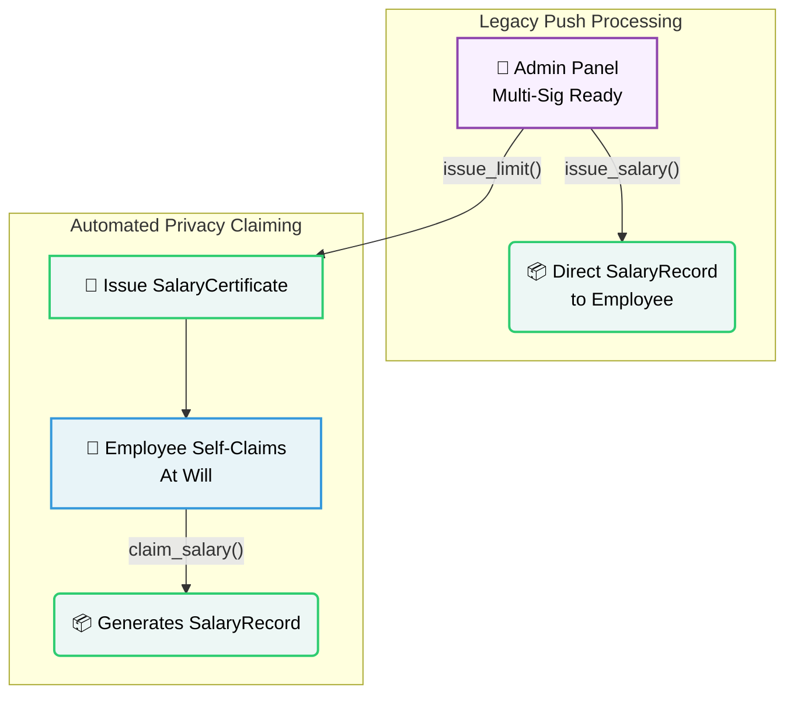

# 🔐 ZK Payroll

**Enterprise-Grade, Privacy-Preserving DAO Payments on the Aleo Network**

> **ZK Payroll solves the "Compliance-Privacy Paradox" by enabling organizations to prove budget solvency to auditors via selective disclosure, without ever exposing individual salaries or employee data to the public.** 
> **Built natively on Aleo for total privacy, public verifiability, and M-of-N Multi-Sig enterprise security.**

[](https://aleo.org)
[](https://nextjs.org/)
[](#)

## 🌐 Live Demos

- **Live Application:** [https://zk-payroll.vercel.app/](https://zk-payroll.vercel.app/)
- **Demo Video:** [Watch on YouTube](https://youtu.be/21zNfbOz614?si=TT9mEVVVMgmv54_I)

---

## 🎯 The Problem

Public blockchains inherently expose all transaction data. When managing payroll on-chain:
- 💸 Competitors can analyze your compensation structure.
- 👀 Salaries become publicly searchable and trackable.
- 📊 Payment timing reveals organizational cash flow and burn rates.

## 💡 The Solution

ZK Payroll leverages **Zero-Knowledge Proofs (ZKPs)** to execute entirely private salary transactions while enforcing a **public mathematical budget and compliance reporting limits**. 

We ensure total operational privacy for the contributor and complete solvency transparency for the organization.

---

## 👁️ Privacy Matrix: Who Sees What?

Through cryptography and selective disclosure, ZK Payroll dynamically restricts data visibility depending on the participant's role.

| Data | 🌐 Public Observer | 📋 Auditor | 🔐 Admin |
|------|:------------------:|:----------:|:--------:|
| Budget Ceiling | ✅ Visible | ✅ Visible | ✅ Visible* |
| Total Spent | ❌ Hidden | ✅ Verified | ✅ Visible* |
| Individual Salaries | ❌ Hidden | ❌ Hidden | ✅ Visible* |
| Payment Timing | ❌ Hidden | ❌ Hidden | ✅ Visible* |
| Compliance Validity | ✅ ZK-Proven | ✅ ZK-Proven | ✅ ZK-Proven |

> * *Admin visibility is strictly limited to local decryption contexts. Push payments update the admin's tracking directly, while Pull payments (Employee Claims) protect employee privacy entirely.*

---

## 🔄 Architecture Models

ZK Payroll caters to both automated enterprise scaling and strict real-time audit approvals natively:


```mermaid
flowchart TD
    classDef admin fill:#f9f0ff,stroke:#8e44ad,stroke-width:2px,color:#000000;
    classDef worker fill:#e8f4f8,stroke:#3498db,stroke-width:2px,color:#000000;
    classDef chain fill:#edf7f5,stroke:#2ecc71,stroke-width:2px,color:#000000;

    A[🔐 Admin Panel<br/>Multi-Sig Ready]:::admin
    
    subgraph Push Model [Legacy Push Processing]
        A -- "issue_salary()" --> B(📦 Direct SalaryRecord<br/>to Employee):::chain
    end
    
    subgraph Pull Model [Automated Privacy Claiming]
        A -- "issue_limit()" --> C[📜 Issue SalaryCertificate]:::chain
        C --> D[👷 Employee Self-Claims<br/>At Will]:::worker
        D -- "claim_salary()" --> E(📦 Generates SalaryRecord):::chain
    end
```

### 1. The Pull Model (Automated Claiming)
- **Use Case:** Core teams, recurring salaries, and ultimate employee privacy.
- **Flow:** An Admin issues a mathematical bounding limit (`SalaryCertificate`). Employees autonomously claim their salary on their own schedule.
- **Privacy Barrier:** The employee generates the final ZK Proof. The organization knows the budget is reserved, but the exact timing and execution of the claim remain entirely private to the employee.

### 2. The Push Model (Direct Issue)
- **Use Case:** Independent contractors, one-off payments, strict auditor coupling.
- **Flow:** Admins authorize and execute the paycheck directly (`issue_salary`) requiring M-of-N threshold signatures. 
- **Tracking:** The Admin's private organizational `SpentRecord` is synchronously updated, guaranteeing immediate compliance alignment.

---

## 💻 Tech Stack & Structure

A production-grade Next.js dApp serves as the primary GUI, communicating with the Aleo network via `@provablehq` adapters.

```
zk_payroll/
├── src/main.leo           # Core Aleo Smart Contract (~400 lines)
├── web/                   # Next.js 14 App Router Interface
│   ├── app/admin/         # Multi-Sig Dashboard & Batch Operations
│   ├── app/employee/      # Self-serve Claiming Portal
│   └── app/auditor/       # Selective Disclosure Compliance Dashboard
├── docs/                  # Architecture & Testing Documentation
└── README.md
```

### Local Development
```bash
# Clone the repository
git clone https://github.com/PhanTom497/zk_payroll.git
cd zk_payroll/web

# Install and run
npm install
npm run dev
```

---

## 🗺️ Vision & Roadmap

ZK Payroll is marching towards becoming the foundational primitive for all Web3 organizational payments.

| Phase | Description | Status |
|-------|-------------|--------|
| **Wave 1** | Core ZK Payload, Selective Disclosure, Testnet Deployment | ✅ Complete |
| **Wave 2** | Next.js Overhaul, M-of-N Admins, Pull Payments, React Dashboards | ✅ Complete |
| **Wave 3** | Token Contracts (Stablecoins), Real `credits.aleo` integration | 🏗️ Planned |
| **Wave 4** | Zero-Knowledge Tax Reporting Oracles, Linear Vesting Portals | 🏗️ Planned |

---

## 📄 License & Grants
- **License:** MIT
- **Built for Aleo Privacy Buildathon** 🏆
- **Grant/Funding Wallet (Aleo):** `aleo1luatvgqmdt0j662lpgh0tf3l07tkjeq6rrr6c7qzzwnmtjwvy5ps4mk6kr`
