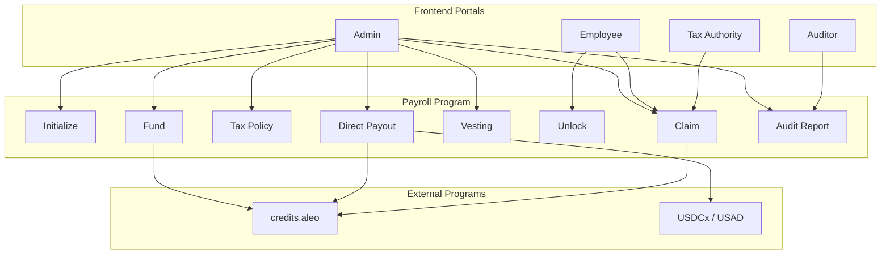
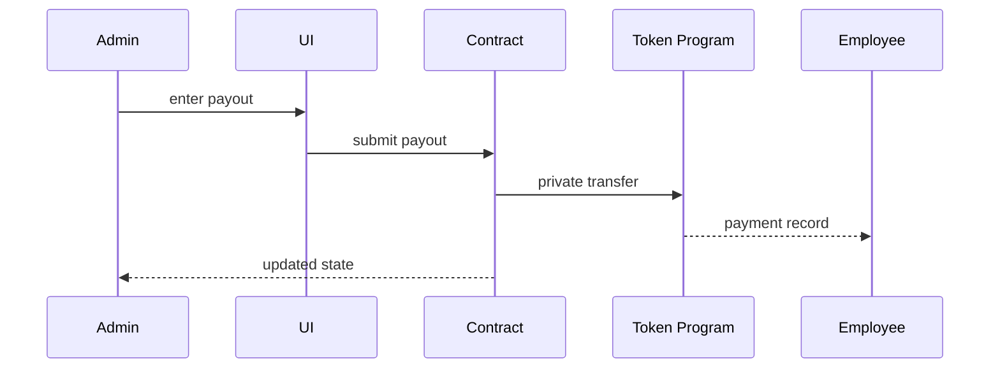
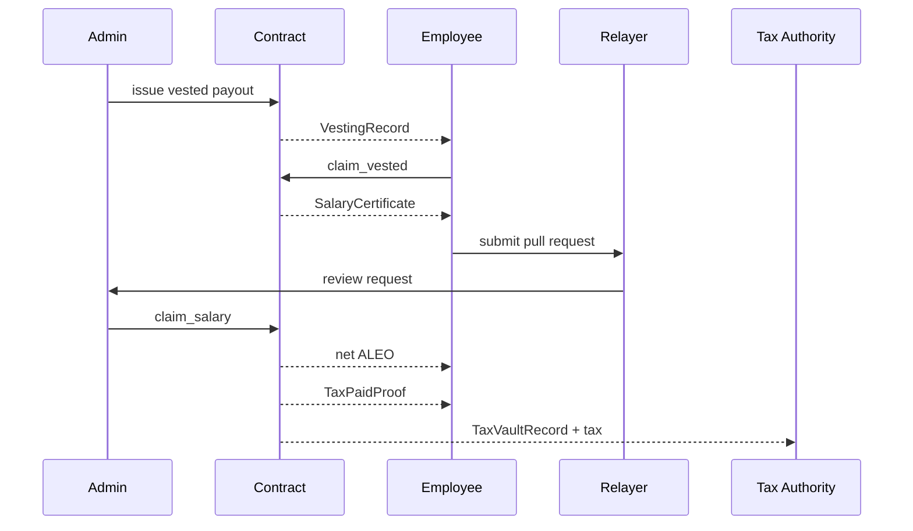
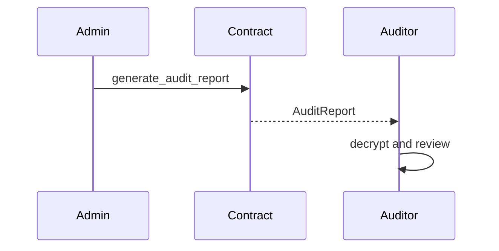
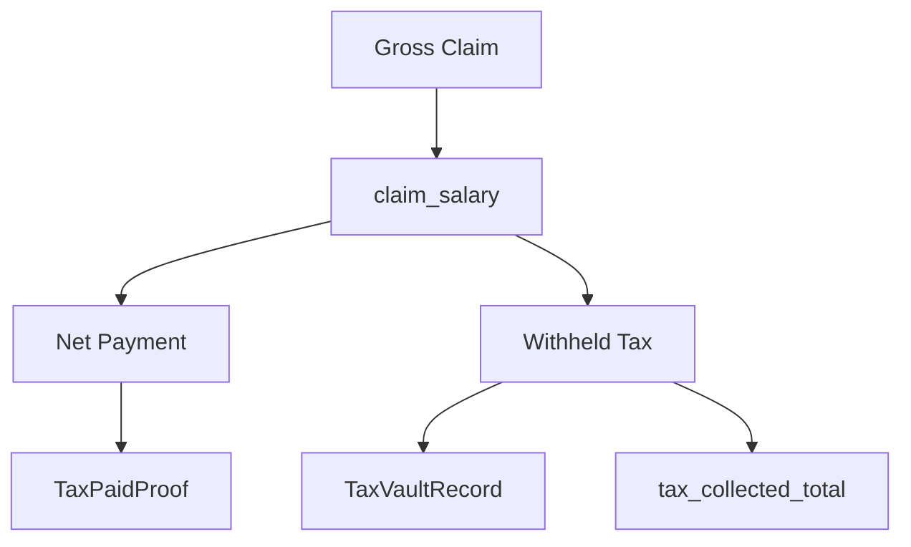

# ZK Payroll

**Privacy-preserving payroll infrastructure for modern teams, built on Aleo.**

> ZK Payroll helps organizations run payroll without exposing salaries, recipients, treasury operations, or compliance-sensitive metadata as public blockchain activity.

[](https://aleo.org)
[](https://nextjs.org/)
[](https://developer.aleo.org/leo/)
[](#)
[](LICENSE)

---

## 🌐 Live Links

- **Live app:** [https://zk-payroll.vercel.app/](https://zk-payroll.vercel.app/)
- **Demo video:** [https://youtu.be/AFNqGmKYIfg](https://youtu.be/AFNqGmKYIfg)
- **Frontend docs:** [https://zk-payroll.vercel.app/docs](https://zk-payroll.vercel.app/docs)

---

## 📋 Table of Contents

- [🚀 Key Features at a Glance](#-key-features-at-a-glance)
- [🎯 Why ZK Payroll](#-why-zk-payroll)
- [✅ What the Product Does Today](#-what-the-product-does-today)
- [👁️ Privacy Matrix](#-privacy-matrix)
- [🏗️ System Architecture](#️-system-architecture)
- [🔄 Payroll Flows](#-payroll-flows)
- [🧾 Tax Withholding Model](#-tax-withholding-model)
- [📊 Analytics Model](#-analytics-model)
- [📜 Smart Contract Surface](#-smart-contract-surface)
- [🧑‍💼 Portal Overview](#-portal-overview)
- [📁 Project Structure](#-project-structure)
- [🚀 Getting Started](#-getting-started)
- [🧪 Testing and Docs](#-testing-and-docs)
- [🗺️ Roadmap Snapshot](#️-roadmap-snapshot)
- [🔒 Security Notes](#-security-notes)
- [📄 License](#-license)

---

## 🚀 Key Features at a Glance

| Area                          | Current State         | Why it matters                                                                    |
| ----------------------------- | --------------------- | --------------------------------------------------------------------------------- |
| **Private payroll records**   | **Live**              | salary and treasury records stay private to the right wallet                      |
| **Direct payouts**            | **Live**              | supports `credits.aleo`, `USDCx`, and `USAD` push payments                        |
| **Delayed vesting**           | **Live**              | enables unlock-based native payroll workflows                                     |
| **Relayer-backed claims**     | **Live**              | employees can request native claim settlement without managing treasury execution |
| **Tax withholding MVP**       | **Live**              | native `claim_salary` splits gross, tax, and net automatically                    |
| **Audit reporting**           | **Live**              | auditors receive private aggregate reports instead of raw salary data             |
| **Admin analytics**           | **Live**              | aggregate payroll insights without exposing raw employee tables                   |
| **Tax authority portal**      | **Live**              | authority wallet can review private withholding receipts                          |
| **Advanced batch processing** | **Planned next wave** | current payroll cycle runner is sequential, not full parallel batching            |

---

## 🎯 Why ZK Payroll

Traditional payroll systems assume a trusted internal database. Public blockchains do not. Without privacy protections, on-chain payroll leaks:

| Risk                        | What leaks                                 | Why it matters                                        |
| --------------------------- | ------------------------------------------ | ----------------------------------------------------- |
| **Salary exposure**         | compensation amounts                       | reveals compensation bands and negotiation leverage   |
| **Treasury visibility**     | payout timing and burn pattern             | exposes runway and operating behavior                 |
| **Identity linkage**        | recipient addresses and payment history    | maps contributors to financial activity               |
| **Weak compliance options** | either reveal everything or reveal nothing | makes private operations difficult to audit correctly |

ZK Payroll solves that tradeoff with **private Aleo records**, **public constraint mappings**, and **role-specific disclosure**:

- **private salary and treasury records**
- **auditable aggregate reporting**
- **role-based access to sensitive outputs**
- **native support for direct payouts, vesting, relayer-backed claims, and tax receipts**

---

## ✅ What the Product Does Today

ZK Payroll currently runs as a **multi-portal payroll workflow on Aleo Testnet**.

### Core capabilities

- **private payroll initialization** with admin and auditor setup
- **native ALEO funding** and payroll budget tracking
- **direct push payments** in `credits.aleo`, `USDCx`, and `USAD`
- **delayed native ALEO vesting** through `VestingRecord`
- **employee unlock flow** through `claim_vested`
- **relayer-backed claim settlement** through `claim_salary`
- **tax withholding** on native claim settlement
- **auditor-only** private `AuditReport` generation and review
- **tax-authority-only** private `TaxVaultRecord` review
- **frontend analytics** using wallet context plus local portal event history

### Current deployed program

- **Program ID:** `baba_zk_payroll_v24.aleo`
- **Network:** Aleo Testnet
- **Frontend stack:** Next.js 14
- **Contract language:** Leo

---

## 👁️ Privacy Matrix

| Data / Capability        | Public Observer |               Admin                | Employee |        Auditor        |     Tax Authority      |
| ------------------------ | :-------------: | :--------------------------------: | :------: | :-------------------: | :--------------------: |
| Budget ceiling mapping   |       Yes       |                Yes                 |    No    |          Yes          |           No           |
| Private salary records   |       No        |   Operationally originates them    | Own only |          No           |           No           |
| Vesting records          |       No        | Operational visibility in workflow | Own only |          No           |           No           |
| Audit reports            |       No        |            Can generate            |    No    | Assigned reports only |           No           |
| Tax paid proof           |       No        |                 No                 | Own only |          No           |           No           |
| Tax vault receipt        |       No        |                 No                 |    No    |          No           | Assigned receipts only |
| Aggregate analytics      |       No        |                Yes                 |    No    |          No           |           No           |
| Tax policy configuration |       No        |                Yes                 |    No    |          No           |           No           |

The key design principle is simple: **ownership of private records determines what a wallet can decrypt**.

---

## 🏗️ System Architecture


```mermaid
flowchart TD
    subgraph UI["Frontend Portals"]
        A[Admin]
        E[Employee]
        U[Auditor]
        T[Tax Authority]
    end

    subgraph P["Payroll Program"]
        I[Initialize]
        F[Fund]
        X[Tax Policy]
        D[Direct Payout]
        V[Vesting]
        K[Unlock]
        C[Claim]
        R[Audit Report]
    end

    subgraph N["External Programs"]
        CR[credits.aleo]
        ST[USDCx / USAD]
    end

    A --> I
    A --> F
    A --> X
    A --> D
    A --> V
    A --> C
    A --> R
    E --> K
    E --> C
    U --> R
    T --> C
    F --> CR
    D --> CR
    D --> ST
    C --> CR
```

### Architectural split

- **Contract layer** enforces payroll rules, claim protection, tax policy, and private record transitions.
- **Frontend layer** handles wallet UX, record scanning, role-specific views, and analytics aggregation.
- **Wallet layer** is responsible for decrypting records owned by the connected user.

---

## 🔄 Payroll Flows

ZK Payroll supports **immediate payouts** and **delayed native claim flows**.

### 1. Instant Push Payroll

**Best for:**

- **one-off payments**
- **contractor payouts**
- **instant compensation**
- **stablecoin transfers**


```mermaid
sequenceDiagram
    participant A as Admin
    participant U as UI
    participant C as Contract
    participant T as Token Program
    participant E as Employee

    A->>U: enter payout
    U->>C: submit payout
    C->>T: private transfer
    T-->>E: payment record
    C-->>A: updated state
```

### 2. Delayed Native Payroll + Claim Flow

**Best for:**

- **salary unlock schedules**
- **admin-reviewed native claims**
- **payroll paths that require withholding at claim time**


```mermaid
sequenceDiagram
    participant A as Admin
    participant C as Contract
    participant E as Employee
    participant R as Relayer
    participant T as Tax Authority

    A->>C: issue vested payout
    C-->>E: VestingRecord
    E->>C: claim_vested
    C-->>E: SalaryCertificate
    E->>R: submit pull request
    R->>A: review request
    A->>C: claim_salary
    C-->>E: net ALEO
    C-->>E: TaxPaidProof
    C-->>T: TaxVaultRecord + tax
```

### 3. Audit Reporting Flow


```mermaid
sequenceDiagram
    participant A as Admin
    participant C as Contract
    participant U as Auditor

    A->>C: generate_audit_report
    C-->>U: AuditReport
    U->>U: decrypt and review
```

---

## 🧾 Tax Withholding Model

**Wave 4** is implemented as an **MVP** on the native `claim_salary` path.

### What happens during a taxed claim

1. Admin sets a payroll-level tax policy with `set_tax_policy`.
2. Employee reaches the native claim path through vesting unlock and relayer approval.
3. `claim_salary` calculates:
   - `gross_amount`
   - `tax_amount`
   - `net_amount`
4. Employee receives net ALEO.
5. Employee also receives a private `TaxPaidProof` record.
6. Tax authority receives withheld ALEO plus a `TaxVaultRecord`.
7. The contract increments `tax_collected_total`.

### Withholding flow diagram


```mermaid
flowchart TD
    G[Gross Claim]
    C[claim_salary]
    N[Net Payment]
    P[TaxPaidProof]
    T[Withheld Tax]
    V[TaxVaultRecord]
    M[tax_collected_total]

    G --> C
    C --> N
    N --> P
    C --> T
    T --> V
    T --> M
```

### Important current limitation

**Tax withholding currently applies only to the native `claim_salary` path.**

It does **not** yet apply to:

- direct ALEO push payouts
- USDCx push payouts
- USAD push payouts

---

## 📊 Analytics Model

The admin analytics dashboard is **privacy-preserving** and **frontend-scoped**.

### Data sources

- **wallet-visible `SpentRecord` snapshots**
- **wallet-visible `AuditReport` context**
- **local analytics events** captured after successful admin actions

### What it shows

- **payout trend** over time
- **token distribution mix**
- **total payout** in selected range
- **active employees** in selected range
- **last payout time**
- **budget context**

### What it does not do

- **no explorer-wide global indexing**
- **no raw employee recipient table** in analytics UI
- **no public disclosure** of individual compensation

---

## 📜 Smart Contract Surface

### Primary private records

| Record              | Purpose                                             |
| ------------------- | --------------------------------------------------- |
| `SpentRecord`       | private cumulative payroll accounting               |
| `SalaryRecord`      | private direct payment record                       |
| `VestingRecord`     | delayed native payout wrapper                       |
| `SalaryCertificate` | unlocked right to proceed through native claim flow |
| `TreasuryRecord`    | treasury-side accounting for funded payroll         |
| `AuditReport`       | auditor-owned private compliance snapshot           |
| `TaxPaidProof`      | employee-owned withholding proof                    |
| `TaxVaultRecord`    | tax-authority-owned withholding receipt             |
| `RecipientTicket`   | legacy helper record retained in codebase           |

### Public mappings

| Mapping                         | Purpose                                                 |
| ------------------------------- | ------------------------------------------------------- |
| `payroll_budgets`               | public payroll ceiling currently recognized by contract |
| `multisig_threshold`            | configured threshold value                              |
| `admin_1`, `admin_2`, `admin_3` | admin wallet identities                                 |
| `claimed_payments`              | duplicate claim protection                              |
| `tax_percentage_bps`            | withholding rate in basis points                        |
| `tax_authority`                 | authority wallet for withheld tax                       |
| `tax_collected_total`           | aggregate withheld amount                               |

### Transition overview

| Transition              | Purpose                                          | Primary actor |
| ----------------------- | ------------------------------------------------ | ------------- |
| `initialize_payroll`    | bootstrap payroll config and first `SpentRecord` | Admin         |
| `fund_payroll`          | fund treasury path and increase budget mapping   | Admin         |
| `set_tax_policy`        | configure payroll-level withholding rule         | Admin         |
| `issue_salary`          | direct native ALEO push payout                   | Admin         |
| `issue_salary_usdcx`    | direct private USDCx payout                      | Admin         |
| `issue_salary_usad`     | direct private USAD payout                       | Admin         |
| `issue_vested_salary`   | create delayed native payout                     | Admin         |
| `claim_vested`          | unlock vested record into `SalaryCertificate`    | Employee      |
| `claim_salary`          | settle native claim with tax split               | Admin relayer |
| `generate_audit_report` | create auditor-owned private report              | Admin         |

---

## 🧑‍💼 Portal Overview

### Admin Portal

**Used for payroll operations.**

Includes:

- setup and payroll initialization
- tax policy configuration
- private funding flow
- pay one employee
- payroll cycle runner
- employee claim approval queue
- audit report generation
- analytics dashboard

### Employee Portal

**Used for employee-side private record workflows.**

Includes:

- record scanning
- vesting unlock flow
- pull-request submission
- direct payment history
- tax proof download

### Auditor Portal

**Used for selective-disclosure compliance review.**

Includes:

- wallet-based `AuditReport` scan
- aggregate report rendering
- period commitment fields

### Tax Authority Portal

**Used for authority-side withholding visibility.**

Includes:

- access check against configured authority wallet
- `TaxVaultRecord` scan
- aggregate withheld totals
- downloadable receipt JSON

---

## 📁 Project Structure

```text
zk_payroll/
├── src/
│   └── main.leo                  # Leo payroll program
├── program.json                  # Program metadata and dependencies
├── docs/
│   ├── ARCHITECTURE.md           # Internal architecture notes
│   ├── ROADMAP.md                # Roadmap and future direction
│   └── TESTING.md                # Testing guide
├── web/
│   ├── app/                      # Next.js routes and portals
│   ├── components/               # Shared UI and workflow components
│   ├── lib/                      # Wallet helpers, analytics helpers, zk utils
│   └── README.md                 # Frontend-specific notes
├── CHECKLIST.md                  # Manual QA checklist
└── README.md                     # Project overview
```

---

## 🚀 Getting Started

### Prerequisites

- Node.js and npm
- Leo
- Aleo-compatible wallet
- Access to Aleo Testnet

### 1. Build the contract

```bash
leo build
```

### 2. Run the frontend

```bash
cd web
npm install
npm run dev
```

Open `http://localhost:3000`.

### 3. Recommended manual flow

1. Open `/admin`
2. Initialize a payroll
3. Configure tax policy
4. Prepare private funds
5. Fund payroll budget
6. Issue a payout or delayed vesting entry
7. Test employee-side record scan and claim flow
8. Generate an audit report
9. Verify tax authority receipt visibility

---

## 🧪 Testing and Docs

Internal project docs:

- [Architecture](./docs/ARCHITECTURE.md)
- [Roadmap](./docs/ROADMAP.md)
- [Testing Guide](./docs/TESTING.md)
- [Manual QA Checklist](./CHECKLIST.md)
- [Web App Notes](./web/README.md)

---

## 🗺️ Roadmap Snapshot

### Completed

- **multi-portal frontend**
- **native + stablecoin push rails**
- **delayed vesting and employee claim flow**
- **auditor reporting**
- **admin analytics dashboard**
- **tax withholding MVP**
- **dedicated tax authority portal**

### In progress / next practical steps

- **expand withholding** to direct payout paths if desired
- **strengthen batch payroll** beyond sequential execution
- **improve stablecoin payroll ergonomics** further
- **deepen compliance exports** and reporting
- **continue polishing HR-style operator UX**

For the detailed roadmap, see [docs/ROADMAP.md](./docs/ROADMAP.md).

---

## 🔒 Security Notes

- **private record ownership** is the primary disclosure boundary
- **public mappings** enforce budget, admin, tax, and replay-protection rules
- `claimed_payments` protects against duplicate native claim settlement
- **tax policy inputs** are validated against stored mappings during `claim_salary`
- frontend role screens improve UX, but real confidentiality still comes from **Aleo record ownership and decryption rules**

---

## 📄 License

MIT
