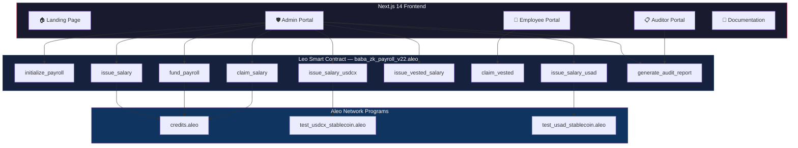
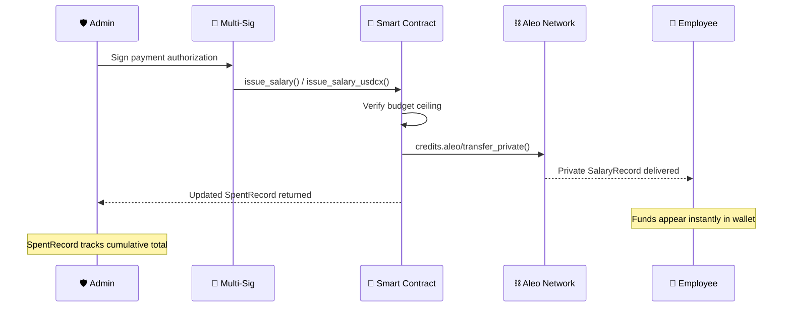
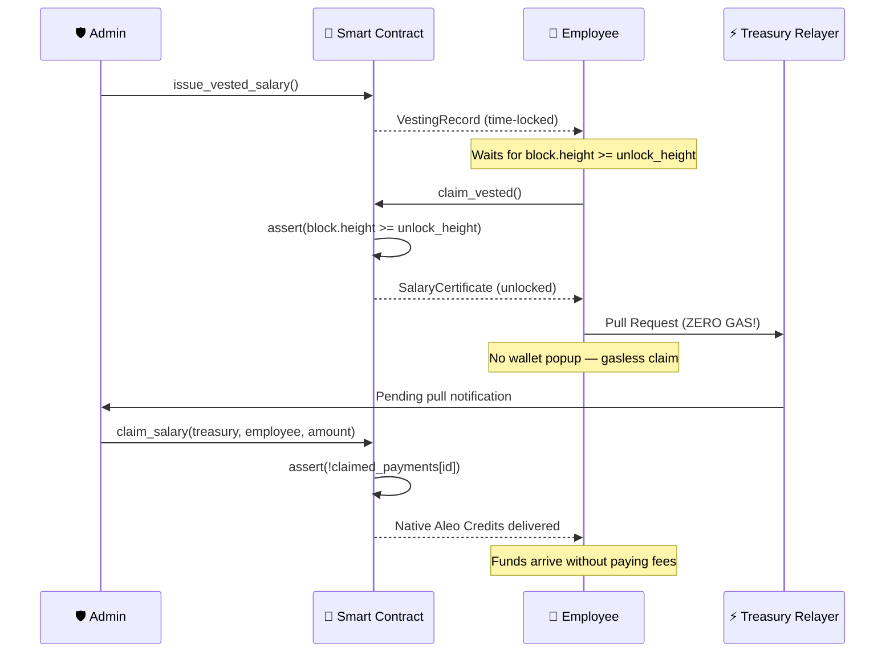
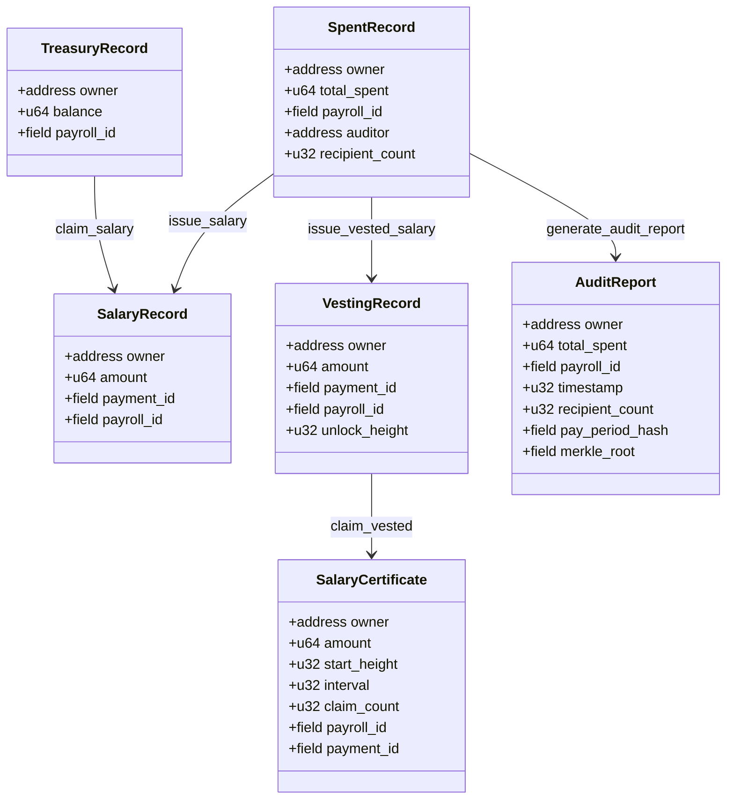
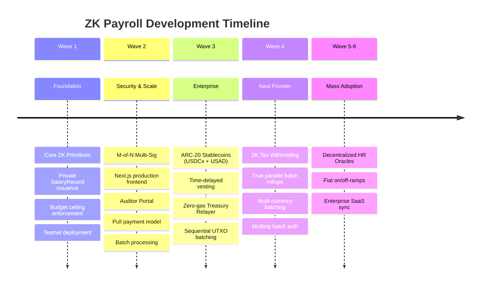
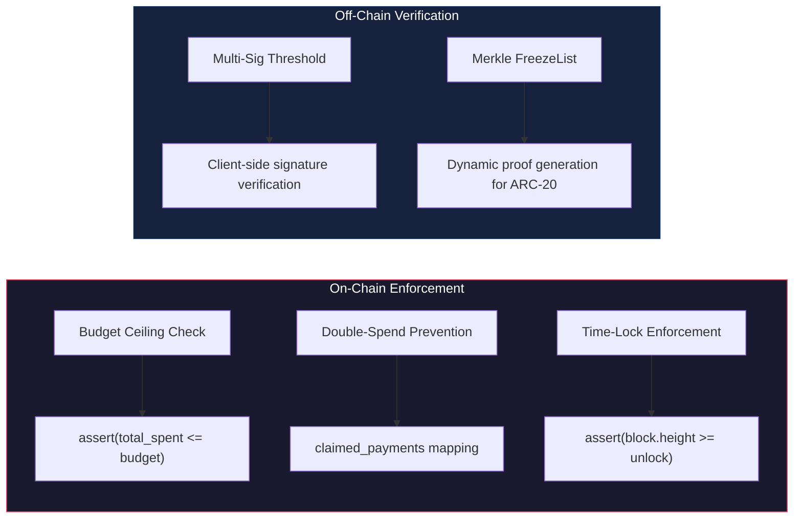

<](https://aleo.org)
[](https://nextjs.org/)
[](https://developer.aleo.org/leo/)
[](#)
[](LICENSE)

---

[**🌐 Live App**](https://zk-payroll.vercel.app/) · [**🎬 Demo Video**](https://youtu.be/5tLcCazfbEI) · [**📖 Documentation**](https://zk-payroll.vercel.app/docs)

</div>

---

## 📋 Table of Contents

- [The Problem](#-the-problem)
- [The Solution](#-the-solution)
- [Privacy Matrix](#-privacy-matrix-who-sees-what)
- [Architecture Overview](#-architecture-overview)
- [Payment Models](#-payment-models)
- [Smart Contract Design](#-smart-contract-design)
- [Key Features](#-key-features)
- [Tech Stack](#-tech-stack--project-structure)
- [Getting Started](#-getting-started)
- [Roadmap](#-development-roadmap)
- [License](#-license)

---

## 🎯 The Problem

Public blockchains inherently expose all transaction data. When managing payroll on-chain:

| Risk | Impact |
|------|--------|
| 💸 **Salary Exposure** | Competitors analyze your entire compensation structure |
| 👀 **Identity Tracking** | Contributor addresses are linked to payment amounts |
| 📊 **Cash Flow Leaks** | Payment timing reveals burn rate and runway |
| ⚖️ **Compliance Gap** | Without disclosure, auditors cannot verify solvency |

**The core paradox:** Organizations need privacy for salaries but transparency for compliance. You can't have both on a regular blockchain.

## 💡 The Solution

ZK Payroll leverages **Zero-Knowledge Proofs** on the **Aleo Network** to deliver:

- ✅ **Fully private** salary transactions — amounts, recipients, timing are all encrypted
- ✅ **Publicly verifiable** budget solvency — auditors prove compliance without seeing salaries
- ✅ **Multi-currency support** — Native Aleo credits + ARC-20 stablecoins (USDCx, USAD)
- ✅ **Enterprise governance** — M-of-N multi-signature authorization for all payments
- ✅ **Zero-gas employee claims** — Contributors withdraw without paying network fees

---

## 👁️ Privacy Matrix: Who Sees What?

ZK Payroll uses cryptographic selective disclosure to dynamically restrict data visibility per role:

| Data Point | 🌐 Public Observer | 📋 Auditor | 🔐 Admin | 👷 Employee |
|:---|:---:|:---:|:---:|:---:|
| Budget Ceiling | ✅ Visible | ✅ Visible | ✅ Visible | ❌ Hidden |
| Total Spent | ❌ Hidden | ✅ ZK-Verified | ✅ Visible | ❌ Hidden |
| Individual Salaries | ❌ Hidden | ❌ Hidden | ✅ Visible | ✅ Own Only |
| Recipient Identities | ❌ Hidden | ❌ Hidden | ✅ Visible | ✅ Own Only |
| Payment Timing | ❌ Hidden | ❌ Hidden | ✅ Visible | ✅ Own Only |
| Compliance Proof | ✅ ZK-Proven | ✅ ZK-Proven | ✅ ZK-Proven | ❌ N/A |
| Vesting Schedule | ❌ Hidden | ❌ Hidden | ✅ Visible | ✅ Own Only |

---

## 🏗️ Architecture Overview


```mermaid
graph TB
    subgraph Frontend["Next.js 14 Frontend"]
        HP["🏠 Landing Page"]
        AP["🛡️ Admin Portal"]
        EP["👷 Employee Portal"]
        AU["📋 Auditor Portal"]
        DOC["📖 Documentation"]
    end

    subgraph SmartContract["Leo Smart Contract — baba_zk_payroll_v22.aleo"]
        INIT["initialize_payroll"]
        FUND["fund_payroll"]
        IS["issue_salary"]
        ISU["issue_salary_usdcx"]
        ISA["issue_salary_usad"]
        IVS["issue_vested_salary"]
        CV["claim_vested"]
        CS["claim_salary"]
        GAR["generate_audit_report"]
    end

    subgraph ExternalPrograms["Aleo Network Programs"]
        CR["credits.aleo"]
        UX["test_usdcx_stablecoin.aleo"]
        UA["test_usad_stablecoin.aleo"]
    end

    AP --> INIT & FUND & IS & ISU & ISA & IVS & GAR & CS
    EP --> CV
    AU --> GAR

    IS --> CR
    ISU --> UX
    ISA --> UA
    FUND --> CR
    CS --> CR

    style Frontend fill:#1a1a2e,stroke:#e94560,color:#ffffff
    style SmartContract fill:#16213e,stroke:#0f3460,color:#ffffff
    style ExternalPrograms fill:#0f3460,stroke:#533483,color:#ffffff
```

---

## 🔄 Payment Models

ZK Payroll supports two distinct payment architectures, each optimized for different operational needs:

### Push Model — Direct Instant Payments


```mermaid
sequenceDiagram
    participant Admin as 🛡️ Admin
    participant MSig as 🔑 Multi-Sig
    participant Contract as 📜 Smart Contract
    participant Network as ⛓️ Aleo Network
    participant Employee as 👷 Employee

    Admin->>MSig: Sign payment authorization
    MSig->>Contract: issue_salary() / issue_salary_usdcx()
    Contract->>Contract: Verify budget ceiling
    Contract->>Network: credits.aleo/transfer_private()
    Network-->>Employee: Private SalaryRecord delivered
    Contract-->>Admin: Updated SpentRecord returned

    Note over Employee: Funds appear instantly in wallet
    Note over Admin: SpentRecord tracks cumulative total
```

> **Best for:** Contractors, one-off payments, immediate settlements in ALEO / USDCx / USAD

### Pull Model — Zero-Gas Treasury Relayer


```mermaid
sequenceDiagram
    participant Admin as 🛡️ Admin
    participant Contract as 📜 Smart Contract
    participant Employee as 👷 Employee
    participant Relayer as ⚡ Treasury Relayer

    Admin->>Contract: issue_vested_salary()
    Contract-->>Employee: VestingRecord (time-locked)

    Note over Employee: Waits for block.height >= unlock_height

    Employee->>Contract: claim_vested()
    Contract->>Contract: assert(block.height >= unlock_height)
    Contract-->>Employee: SalaryCertificate (unlocked)

    Employee->>Relayer: Pull Request (ZERO GAS!)
    Note over Employee: No wallet popup — gasless claim

    Relayer->>Admin: Pending pull notification
    Admin->>Contract: claim_salary(treasury, employee, amount)
    Contract->>Contract: assert(!claimed_payments[id])
    Contract-->>Employee: Native Aleo Credits delivered

    Note over Employee: Funds arrive without paying fees
```

> **Best for:** Core team salaries, recurring payments, maximum employee privacy

---

## 📜 Smart Contract Design

**Program:** `baba_zk_payroll_v22.aleo` | **Language:** Leo | **Network:** Aleo Testnet

### Record Types


```mermaid
classDiagram
    class SpentRecord {
        +address owner
        +u64 total_spent
        +field payroll_id
        +address auditor
        +u32 recipient_count
    }

    class SalaryRecord {
        +address owner
        +u64 amount
        +field payment_id
        +field payroll_id
    }

    class VestingRecord {
        +address owner
        +u64 amount
        +field payment_id
        +field payroll_id
        +u32 unlock_height
    }

    class SalaryCertificate {
        +address owner
        +u64 amount
        +u32 start_height
        +u32 interval
        +u32 claim_count
        +field payroll_id
        +field payment_id
    }

    class TreasuryRecord {
        +address owner
        +u64 balance
        +field payroll_id
    }

    class AuditReport {
        +address owner
        +u64 total_spent
        +field payroll_id
        +u32 timestamp
        +u32 recipient_count
        +field pay_period_hash
        +field merkle_root
    }

    SpentRecord --> SalaryRecord : issue_salary
    SpentRecord --> VestingRecord : issue_vested_salary
    VestingRecord --> SalaryCertificate : claim_vested
    TreasuryRecord --> SalaryRecord : claim_salary
    SpentRecord --> AuditReport : generate_audit_report
```

### Transition Overview

| Transition | Purpose | Caller |
|:---|:---|:---:|
| `initialize_payroll` | Create DAO with M-of-N admins and budget ceiling | Admin |
| `fund_payroll` | Deposit native credits into Treasury pool | Admin |
| `issue_salary` | Push native Aleo credits privately to employee | Admin |
| `issue_salary_usdcx` | Push USDCx stablecoin privately to employee | Admin |
| `issue_salary_usad` | Push USAD stablecoin privately to employee | Admin |
| `issue_vested_salary` | Create time-locked VestingRecord for employee | Admin |
| `claim_vested` | Unlock VestingRecord → SalaryCertificate | Employee |
| `claim_salary` | Treasury Relayer fulfills employee pull request | Admin |
| `generate_audit_report` | Produce ZK compliance report for auditor | Admin |

### On-Chain Mappings

| Mapping | Type | Purpose |
|:---|:---|:---|
| `payroll_budgets` | `field => u64` | Tracks maximum budget ceiling per DAO |
| `multisig_threshold` | `field => u64` | Stores the M-of-N signature requirement |
| `admin_1`, `admin_2`, `admin_3` | `field => address` | Registered admin wallet addresses |
| `claimed_payments` | `field => bool` | Prevents double-spend on pull claims |

---

## 🌟 Key Features

### 🔑 Enterprise Multi-Signature Authorization
Require M-of-N wallet signatures before any payroll action. Admin threshold is configured during `initialize_payroll` and enforced cryptographically via client-side signature verification before on-chain execution.

### 💱 ARC-20 Stablecoin Support
Native cross-program calls to `test_usdcx_stablecoin.aleo` and `test_usad_stablecoin.aleo`. The frontend dynamically generates Merkle Tree FreezeList proofs required by the ARC-20 standard.

### ⏳ Time-Delayed Vesting
Issue `VestingRecord` grants locked until `block.height >= unlock_height`. The unlock condition is enforced at the ZK circuit level — mathematically impossible to bypass.

### ⚡ Zero-Gas Treasury Relayer
Employees sign gasless off-chain "Pull Requests." The admin's Treasury Relayer processes these asynchronously, paying all network gas on behalf of the employee.

### 📊 ZK Audit Reports
Generate cryptographic compliance proofs containing `total_spent`, `recipient_count`, `merkle_root`, and `pay_period_hash` — selectively disclosed to auditors without revealing individual salary data.

### 🔄 Sequential Batch Processing
Automated UTXO-chain polling enables sequential multi-employee payroll runs without double-spend collisions.

---

## 💻 Tech Stack & Project Structure

| Layer | Technology |
|:---|:---|
| **Smart Contract** | Leo (Aleo) — `baba_zk_payroll_v22.aleo` |
| **Frontend** | Next.js 14 (App Router) |
| **Wallet** | `@provablehq/aleo-wallet-adaptor` (Leo/Puzzle Wallet) |
| **Stablecoins** | `test_usdcx_stablecoin.aleo`, `test_usad_stablecoin.aleo` |
| **Cryptography** | `@provablehq/sdk` (client-side signature verification) |
| **Network** | Aleo Testnet |
| **Deployment** | Vercel |

```
zk_payroll/
├── src/
│   └── main.leo                  # Core Leo smart contract (446 lines)
├── web/
│   ├── app/
│   │   ├── page.tsx              # Landing page
│   │   ├── admin/page.tsx        # Admin Portal (Multi-Sig, Batch, Relayer, Audit)
│   │   ├── employee/page.tsx     # Employee Portal (Scan, Claim, Withdraw)
│   │   ├── auditor/page.tsx      # Auditor Portal (Fetch & Verify Reports)
│   │   └── docs/page.tsx         # Documentation (Overview, Architecture, Security)
│   ├── components/
│   │   ├── AleoWalletProvider.tsx # Global wallet context with auto-connect
│   │   ├── WalletConnectButton.tsx
│   │   ├── GlassCard.tsx         # Reusable glassmorphism UI component
│   │   └── GlobalAutoConnect.tsx  # Persistent wallet reconnection logic
│   └── lib/
│       └── zk-utils.ts           # Transaction helpers, UTXO polling, record parsing
├── docs/
│   └── ROADMAP.md                # Full development roadmap (Waves 1-6)
├── imports/                      # Aleo program dependencies
├── build/                        # Compiled Aleo artifacts
└── program.json                  # Program manifest with dependencies
```

---

## 🚀 Getting Started

### Prerequisites
- **Node.js** ≥ 18
- **Leo Wallet** or **Puzzle Wallet** browser extension
- Wallet configured for **Aleo Testnet**

### Local Development

```bash
# Clone the repository
git clone https://github.com/PhanTom497/zk_payroll.git
cd zk_payroll/web

# Install dependencies
npm install

# Start the development server
npm run dev
```

The app will be running at `http://localhost:3000`

### Production Build

```bash
npm run build
npm start
```

---

## 🗺️ Development Roadmap


```mermaid
timeline
    title ZK Payroll Development Timeline
    
    section Wave 1
        Foundation : Core ZK Primitives
                   : Private SalaryRecord issuance
                   : Budget ceiling enforcement
                   : Testnet deployment
    
    section Wave 2
        Security & Scale : M-of-N Multi-Sig
                         : Next.js production frontend
                         : Auditor Portal
                         : Pull payment model
                         : Batch processing
    
    section Wave 3
        Enterprise : ARC-20 Stablecoins (USDCx + USAD)
                   : Time-delayed vesting
                   : Zero-gas Treasury Relayer
                   : Sequential UTXO batching
    
    section Wave 4
        Next Frontier : ZK Tax Withholding
                      : True parallel batch rollups
                      : Multi-currency batching
                      : Multisig batch auth
    
    section Wave 5-6
        Mass Adoption : Decentralized HR Oracles
                      : Fiat on/off-ramps
                      : Enterprise SaaS sync
```

| Wave | Focus | Status |
|:---|:---|:---:|
| **Wave 1** | Core ZK Primitives, Testnet Deployment | ✅ Complete |
| **Wave 2** | Multi-Sig, Pull Payments, React Frontend, Auditor Portal | ✅ Complete |
| **Wave 3** | ARC-20 Stablecoins, Time-Delayed Vesting, Treasury Relayer | ✅ Complete |
| **Wave 4** | ZK Tax Withholding, Parallel Batch Rollups, Multi-Currency Batching | 🔜 Next |
| **Wave 5** | Decentralized HR Oracles (BambooHR/Deel Sync) | 🏗️ Planned |
| **Wave 6** | Fiat On/Off-Ramps (MoonPay/Stripe Integration) | 🏗️ Planned |

---

## 🔒 Security Guarantees


```mermaid
graph LR
    subgraph OnChain["On-Chain Enforcement"]
        A["Budget Ceiling Check"] --> B["assert(total_spent <= budget)"]
        C["Double-Spend Prevention"] --> D["claimed_payments mapping"]
        E["Time-Lock Enforcement"] --> F["assert(block.height >= unlock)"]
    end

    subgraph OffChain["Off-Chain Verification"]
        G["Multi-Sig Threshold"] --> H["Client-side signature verification"]
        I["Merkle FreezeList"] --> J["Dynamic proof generation for ARC-20"]
    end

    style OnChain fill:#1a1a2e,stroke:#e94560,color:#ffffff
    style OffChain fill:#16213e,stroke:#0f3460,color:#ffffff
```

- **Budget Enforcement:** Every `issue_salary` transition asserts `total_spent <= budget_ceiling` on-chain
- **Double-Spend Prevention:** `claimed_payments` mapping prevents any payment ID from being redeemed twice
- **Time-Lock:** `claim_vested` enforces `block.height >= unlock_height` at the ZK circuit level
- **Multi-Sig:** M-of-N wallet signatures verified before any payroll execution reaches the network
- **UTXO Isolation:** Each UTXO record is consumed exactly once via Aleo's native model

---

## 📄 License

This project is licensed under the **MIT License**.

**Built for the Aleo Privacy Buildathon** 🏆

**Grant/Funding Wallet (Aleo):** `aleo1luatvgqmdt0j662lpgh0tf3l07tkjeq6rrr6c7qzzwnmtjwvy5ps4mk6kr`
]]>
