# 🔐 ZK Payroll

**Privacy-Preserving DAO Payments on Aleo**

> **ZK Payroll solves the "Compliance-Privacy Paradox" by enabling DAO administrators to prove budget solvency to auditors without ever revealing individual contributor data.**
> **Built on Aleo for total privacy and public verifiability.**

[](https://aleo.org)
[](https://leo-lang.org)
[](https://aleo.org)

---

## 🎯 Problem

Public blockchains expose all transaction data. For DAO payroll:
- 💸 Competitors see your compensation structure
- 👀 Salaries become publicly searchable  
- 📊 Payment timing reveals cash flow

## 💡 Solution

ZK Payroll uses Aleo's zero-knowledge proofs to enable **private salaries with public budget enforcement**, ensuring both contributor privacy and organizational transparency.

---

## ⛓️ On-Chain Verification

**Live Aleo Testnet Proofs** (Judges check here):

| Type | Transaction ID | Status |
|------|----------------|--------|
| **Deployment** | [`at1swvsjd...`](https://testnet.explorer.provable.com/transaction/at1swvsjd7weuku62jhgpaya3twlwtqalq65wg7zlfy9y9t4uqpsugqpn3kmg) | ✅ Accepted |
| **Execution** | [`at1qengyj...`](https://testnet.explorer.provable.com/transaction/at1qengyjkrdlkrtqdvljr9hl7a6qu8uzaa0yxkmljh6zqwhf9zuyxs3jwg74) | ✅ Accepted |

### Deployment Proof


### Execution Proof


---

## 👁️ Privacy Meter: Who Sees What?

| Data | 🌐 Public Observer | 📋 Auditor | 🔐 Admin |
|------|:------------------:|:----------:|:--------:|
| Budget Ceiling | ✅ Visible | ✅ Visible | ✅ Visible* |
| Total Spent | ❌ Hidden | ✅ Verified | ✅ Visible* |
| Individual Salaries | ❌ Hidden | ❌ Hidden | ✅ Visible* |
| Recipient Addresses | ❌ Hidden | ❌ Hidden | ✅ Visible* |
| Payment Timing | ❌ Hidden | ❌ Hidden | ✅ Visible* |
| Budget Compliance | ✅ ZK-Proven | ✅ ZK-Proven | ✅ ZK-Proven |

> * *Admin visibility is limited to local history; once a SalaryRecord is issued, only the recipient can decrypt and spend it.*

> **Key Insight**: Auditors verify totals without seeing individual salaries. Public observers only see the budget limit and ZK proof validity.

---

## 🖼️ Auditor Portal Demo


*The Auditor Portal shows how compliance officers receive verified spending totals via selective disclosure—without seeing individual employee salaries.*

---

## 🔄 Payment Lifecycle

```mermaid
flowchart LR
    A[🔐 Admin] -->|issue_salary| B[⚡ ZK Proof]
    B -->|verify| C{Budget Check}
    C -->|pass| D[📦 SalaryRecord]
    C -->|fail| E[❌ Rejected]
    D -->|encrypted| F[👤 Recipient]
    
    subgraph On-Chain
        C
        G[📊 Mapping: payroll_budgets]
    end
    
    subgraph Private Records
        D
        F
    end
    
    B -.->|read budget| G
```



---

## 🚀 Quick Start

```bash
# Clone
git clone https://github.com/PhanTom497/zk_payroll.git
cd zk_payroll

# Build
leo build

# Run demo
leo run initialize_payroll 1000u64 1field <AUDITOR_ADDRESS>
```

### One-Command Verify

```bash
# Run the full test suite
chmod +x test.sh && ./test.sh
```

---

## 📁 Project Structure

```
zk_payroll/
├── [src/main.leo](./src/main.leo)   # Core contract (66 statements)
├── demo/                  # Interactive web demo
│   ├── index.html
│   ├── style.css
│   └── demo.js
├── docs/
│   ├── ARCHITECTURE.md   # Technical deep-dive
│   ├── TESTING.md        # Test commands
│   └── screenshots/      # Demo screenshots
├── test.sh               # One-command verify
└── README.md
```

---

## 🛡️ Security Model

| Attack Vector | Mitigation |
|---------------|------------|
| Fake budget input | Read from on-chain mapping |
| Stolen AdminCap | `self.caller == owner` check |
| Address leakage | RecipientTicket pattern |
| Cross-payroll replay | Payroll ID consistency |

---

## ⚖️ Compliance & Audit Trail

ZK Payroll enables **regulatory compliance without sacrificing contributor privacy**:

### Selective Disclosure
- Admin generates `AuditReport` for authorized auditors
- Auditors verify `total_spent ≤ budget` without individual salaries
- Report includes immutable `timestamp` for audit trail

### Immutable Timestamp
```
AuditReport {
  owner: auditor_address,
  total_spent: 750u64,        // Verified total
  payroll_id: 1field,
  timestamp: 1738181000u32    // Immutable audit trail
}
```


## 📊 Contract Stats

| Metric | Value |
|--------|-------|
| Records | 5 (AdminCap, SpentRecord, RecipientTicket, SalaryRecord, AuditReport) |
| Transitions | 4 |
| Program Size | 3.06 KB |
| Statements | 66 |
| **Standards** | ✅ **ARC-0006 Compliant** (Async Constructors) |

---

## 🗺️ Roadmap

| Wave | Feature | Status |
|------|---------|--------|
| 1 | Core ZK Payroll + Selective Disclosure + Testnet Deployment | ✅ Complete |
| 2 | Multi-sig Admin | Planned |
| 3 | Recurring Payments | Planned |
| 4+ | Token Integration | Planned |

---
Aleo wallet for grant distribution :- aleo1luatvgqmdt0j662lpgh0tf3l07tkjeq6rrr6c7qzzwnmtjwvy5ps4mk6kr
---

## 📄 License

MIT

---

**Built for Aleo Privacy Buildathon 2026** 🏆
