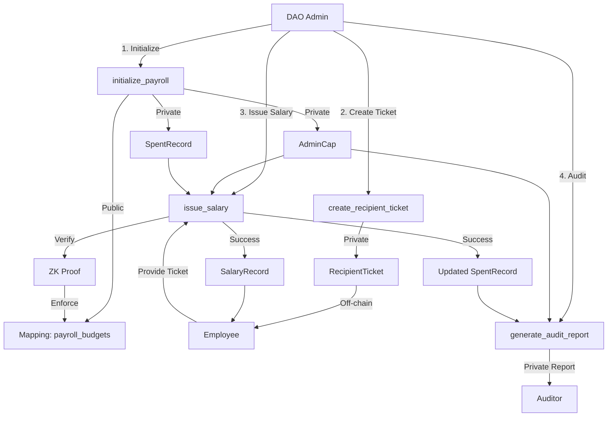

# ZK Payroll Architecture

## System Overview

ZK Payroll is a privacy-preserving payroll management system built on Aleo. It leverages zero-knowledge proofs (ZKPs) to enable private salary payments while enforcing a public budget ceiling. This hybrid model ensures both contributor privacy and organizational transparency.

---

## core Components

### 1. Smart Contract (`main.leo`)

The heart of the system, written in Leo. It manages:

- **State Records**: Encrypted data structures for admin control, spending tracking, and recipient tickets.
- **Transitions**: Functions that execute logic and generate ZK proofs.
- **Mappings**: Public on-chain storage for budget enforcement.

### 2. Record Structures

#### `AdminCap`
- **Owner**: Admin
- **Purpose**: Controlling payroll operations
- **Privacy**: Fully encrypted (`owner` and `payroll_id` are private)
- **Fields**:
  - `owner`: Address of the admin
  - `payroll_id`: Unique identifier for the payroll instance
  - `auditor`: Address of the authorized auditor (Wave 2 feature)

#### `SpentRecord`
- **Owner**: Admin
- **Purpose**: Tracking cumulative spending privately
- **Privacy**: `total_spent` is encrypted but proven correct via ZK
- **Fields**:
  - `owner`: Address of the admin
  - `total_spent`: u64, cumulative amount paid out so far (private)
  - `payroll_id`: Links to the payroll instance
  - `auditor`: Address of the authorized auditor

#### `RecipientTicket`
- **Owner**: Recipient (Employee)
- **Purpose**: Authenticating a recipient without revealing their identity during payout
- **Privacy**: Encrypted record owned by the employee
- **Fields**:
  - `owner`: Address of the employee
  - `payroll_id`: Links to the correct payroll instance

#### `SalaryRecord`
- **Owner**: Recipient (Employee)
- **Purpose**: The actual payment record
- **Privacy**: Only the recipient can decrypt the amount
- **Fields**:
  - `owner`: Address of the employee
  - `amount`: u64, the salary amount (private)
  - `payment_id`: Unique ID for the payment transaction
  - `payroll_id`: Links to the payroll instance

#### `AuditReport` (Wave 2)
- **Owner**: Auditor
- **Purpose**: Providing proof of solvency to a designated auditor
- **Privacy**: Encrypted for the auditor; reveals `total_spent` without individual salaries
- **Fields**:
  - `owner`: Auditor's address
  - `total_spent`: u64, current total spending (private)
  - `payroll_id`: Links to payroll instance
  - `timestamp`: u32, time of report generation

---

## Data Flow & Architecture Diagram

---

## Key Privacy Features

1.  **Private Salaries**: The `amount` in `SalaryRecord` is encrypted. Only the employee can see their salary.
2.  **Hidden Total Spent**: The `total_spent` in `SpentRecord` is encrypted. The public only sees that a valid transition occurred, ensuring the total is $\le$ the budget.
3.  **Selective Disclosure**: The `AuditReport` allows the admin to reveal the `total_spent` to a specific auditor without making it public.
4.  **Recipient Privacy**: `RecipientTicket` allows employees to receive funds without their address being directly linked to the payout transaction in cleartext arguments.

---

## Security Model

-   **Budget Enforcement**: The `finalize` block of `issue_salary` asserts that `new_total_spent <= budget_ceiling`. This is enforced by the network consensus.
-   **Access Control**: Only the holder of `AdminCap` can issue salaries or create tickets.
-   **Double-Spend Protection**: `SpentRecord` is consumed and re-created with an updated total in every `issue_salary` transaction, preventing reuse of old states.
-   **Payroll Isolation**: `payroll_id` ensures that records from one payroll instance cannot be used in another.
